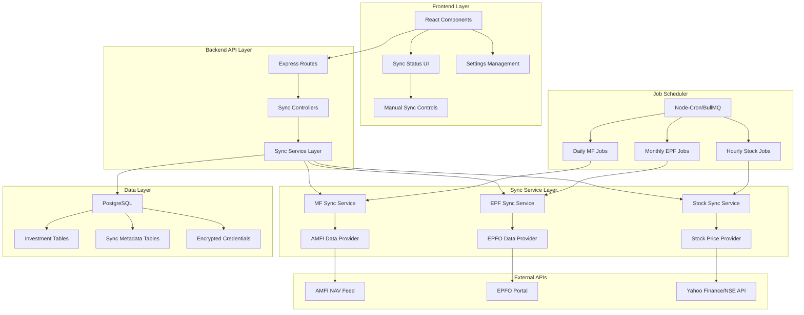

# Design Document

## Overview

The Auto-Sync Integration extends the existing FinVista personal finance dashboard with automated data synchronization capabilities. The system implements a modular, service-oriented architecture that fetches data from official financial sources while maintaining privacy and security. The design emphasizes reliability, modularity, and user control over automated processes.

## Architecture

### System Architecture



### Technology Stack Extensions

**New Backend Dependencies:**
- **Job Scheduling:** `node-cron` for simple scheduling or `bullmq` + `redis` for advanced queue management
- **HTTP Client:** `axios` for external API calls with retry and timeout support
- **Encryption:** `crypto` (Node.js built-in) for credential encryption
- **CSV Parsing:** `csv-parser` for AMFI NAV data processing
- **PDF Parsing:** `pdf-parse` for CAMS/KFintech CAS parsing (optional)
- **Web Scraping:** `puppeteer` for EPFO portal automation (if needed)

**New Frontend Dependencies:**
- **Date Handling:** `date-fns` for sync timestamp formatting
- **Status Indicators:** Enhanced UI components for sync status display

## Components and Interfaces

### Database Schema Extensions

```prisma
// Add to existing schema.prisma

model SyncMetadata {
  id            String   @id @default(cuid())
  userId        String
  investmentType String  // 'mutual_funds', 'epf', 'stocks'
  investmentId   String  // Reference to specific investment
  lastSyncAt     DateTime?
  syncStatus     String  // 'success', 'failed', 'in_progress', 'disabled'
  syncSource     String  // 'amfi', 'epfo', 'yahoo_finance', etc.
  errorMessage   String?
  dataHash       String? // For detecting changes
  createdAt      DateTime @default(now())
  updatedAt      DateTime @updatedAt
  
  user User @relation(fields: [userId], references: [id], onDelete: Cascade)
  
  @@unique([userId, investmentType, investmentId])
  @@index([userId, investmentType])
  @@index([lastSyncAt])
  @@map("sync_metadata")
}

model SyncConfiguration {
  id                String   @id @default(cuid())
  userId            String
  investmentType    String   // 'mutual_funds', 'epf', 'stocks'
  isEnabled         Boolean  @default(true)
  syncFrequency     String   // 'daily', 'hourly', 'monthly'
  preferredSource   String   // Primary data source
  fallbackSource    String?  // Secondary data source
  customSchedule    String?  // Cron expression for custom timing
  notifyOnSuccess   Boolean  @default(false)
  notifyOnFailure   Boolean  @default(true)
  createdAt         DateTime @default(now())
  updatedAt         DateTime @updatedAt
  
  user User @relation(fields: [userId], references: [id], onDelete: Cascade)
  
  @@unique([userId, investmentType])
  @@index([userId])
  @@map("sync_configurations")
}

model EncryptedCredentials {
  id            String   @id @default(cuid())
  userId        String
  service       String   // 'epfo', 'yahoo_finance', etc.
  encryptedData String   // JSON with encrypted credentials
  keyVersion    Int      @default(1)
  createdAt     DateTime @default(now())
  updatedAt     DateTime @updatedAt
  
  user User @relation(fields: [userId], references: [id], onDelete: Cascade)
  
  @@unique([userId, service])
  @@index([userId])
  @@map("encrypted_credentials")
}

// Extend existing models with sync-related fields
model MutualFund {
  // ... existing fields ...
  isin              String?  // For AMFI NAV matching
  schemeCode        String?  // Alternative identifier
  lastSyncAt        DateTime?
  syncStatus        String   @default("manual") // 'manual', 'synced', 'failed'
  manualOverride    Boolean  @default(false)
  
  @@index([isin])
  @@index([schemeCode])
}

model EPFAccount {
  // ... existing fields ...
  uan               String?  // Universal Account Number
  lastSyncAt        DateTime?
  syncStatus        String   @default("manual")
  manualOverride    Boolean  @default(false)
  
  @@index([uan])
}

model Stock {
  // ... existing fields ...
  exchange          String?  // 'NSE', 'BSE'
  isin              String?  // For additional identification
  lastSyncAt        DateTime?
  syncStatus        String   @default("manual")
  manualOverride    Boolean  @default(false)
  
  @@index([exchange, symbol])
  @@index([isin])
}
```

### Service Layer Architecture

```typescript
// src/services/sync/interfaces/DataProvider.ts
interface DataProvider<T> {
  name: string;
  isAvailable(): Promise<boolean>;
  authenticate?(credentials: any): Promise<boolean>;
  fetchData(identifiers: string[]): Promise<T[]>;
  validateData(data: T[]): boolean;
  transformData(data: T[]): any[];
}

// src/services/sync/interfaces/SyncService.ts
interface SyncService {
  syncType: string;
  sync(userId: string, options?: SyncOptions): Promise<SyncResult>;
  syncSingle(userId: string, investmentId: string): Promise<SyncResult>;
  validateConfiguration(config: SyncConfiguration): boolean;
}

interface SyncOptions {
  force?: boolean;
  dryRun?: boolean;
  source?: string;
}

interface SyncResult {
  success: boolean;
  recordsProcessed: number;
  recordsUpdated: number;
  errors: SyncError[];
  duration: number;
  source: string;
}
```

### Mutual Fund Sync Service

```typescript
// src/services/sync/MutualFundSyncService.ts
class MutualFundSyncService implements SyncService {
  private amfiProvider: AMFIDataProvider;
  private mfCentralProvider: MFCentralDataProvider;
  
  constructor() {
    this.amfiProvider = new AMFIDataProvider();
    this.mfCentralProvider = new MFCentralDataProvider();
  }
  
  async sync(userId: string, options: SyncOptions = {}): Promise<SyncResult> {
    const startTime = Date.now();
    const result: SyncResult = {
      success: false,
      recordsProcessed: 0,
      recordsUpdated: 0,
      errors: [],
      duration: 0,
      source: options.source || 'amfi'
    };
    
    try {
      // Get user's mutual funds with ISIN codes
      const userFunds = await this.getUserMutualFunds(userId);
      const isins = userFunds.map(fund => fund.isin).filter(Boolean);
      
      if (isins.length === 0) {
        result.success = true;
        return result;
      }
      
      // Fetch NAV data from provider
      const provider = this.getProvider(options.source);
      const navData = await provider.fetchData(isins);
      
      // Update fund values
      for (const fund of userFunds) {
        if (!fund.isin) continue;
        
        const navRecord = navData.find(nav => nav.isin === fund.isin);
        if (navRecord && !fund.manualOverride) {
          await this.updateFundValue(fund, navRecord, options.dryRun);
          result.recordsUpdated++;
        }
        result.recordsProcessed++;
      }
      
      result.success = true;
    } catch (error) {
      result.errors.push({
        type: 'sync_error',
        message: error.message,
        details: error.stack
      });
    }
    
    result.duration = Date.now() - startTime;
    await this.updateSyncMetadata(userId, result);
    return result;
  }
  
  private async updateFundValue(fund: MutualFund, navData: any, dryRun: boolean) {
    const newValue = this.calculateCurrentValue(fund, navData.nav);
    const newCagr = this.calculateCAGR(fund, newValue);
    
    if (!dryRun) {
      await prisma.mutualFund.update({
        where: { id: fund.id },
        data: {
          currentValue: newValue,
          cagr: newCagr,
          lastSyncAt: new Date(),
          syncStatus: 'synced'
        }
      });
    }
  }
}
```

### AMFI Data Provider

```typescript
// src/services/sync/providers/AMFIDataProvider.ts
class AMFIDataProvider implements DataProvider<NAVRecord> {
  name = 'AMFI';
  private readonly NAV_URL = 'https://www.amfiindia.com/spages/NAVAll.txt';
  
  async isAvailable(): Promise<boolean> {
    try {
      const response = await axios.head(this.NAV_URL, { timeout: 5000 });
      return response.status === 200;
    } catch {
      return false;
    }
  }
  
  async fetchData(isins: string[]): Promise<NAVRecord[]> {
    const response = await axios.get(this.NAV_URL, {
      timeout: 30000,
      responseType: 'text'
    });
    
    const records = this.parseNAVData(response.data);
    return records.filter(record => isins.includes(record.isin));
  }
  
  private parseNAVData(csvData: string): NAVRecord[] {
    const lines = csvData.split('\n');
    const records: NAVRecord[] = [];
    
    for (const line of lines) {
      if (line.trim() && !line.startsWith('Scheme Code')) {
        const parts = line.split(';');
        if (parts.length >= 6) {
          records.push({
            schemeCode: parts[0],
            isin: parts[1],
            schemeName: parts[3],
            nav: parseFloat(parts[4]),
            date: new Date(parts[5])
          });
        }
      }
    }
    
    return records;
  }
  
  validateData(data: NAVRecord[]): boolean {
    return data.every(record => 
      record.nav > 0 && 
      record.isin && 
      record.date instanceof Date
    );
  }
  
  transformData(data: NAVRecord[]): any[] {
    return data.map(record => ({
      identifier: record.isin,
      value: record.nav,
      date: record.date,
      source: this.name
    }));
  }
}
```

### EPF Sync Service

```typescript
// src/services/sync/EPFSyncService.ts
class EPFSyncService implements SyncService {
  private epfoProvider: EPFODataProvider;
  private credentialService: CredentialService;
  
  async sync(userId: string, options: SyncOptions = {}): Promise<SyncResult> {
    const result: SyncResult = {
      success: false,
      recordsProcessed: 0,
      recordsUpdated: 0,
      errors: [],
      duration: 0,
      source: 'epfo'
    };
    
    try {
      // Get encrypted credentials
      const credentials = await this.credentialService.getCredentials(userId, 'epfo');
      if (!credentials) {
        throw new Error('EPF credentials not configured');
      }
      
      // Get user's EPF accounts
      const epfAccounts = await this.getUserEPFAccounts(userId);
      
      for (const account of epfAccounts) {
        if (account.manualOverride) continue;
        
        try {
          const epfData = await this.epfoProvider.fetchAccountData(
            credentials, 
            account.uan || account.pfNumber
          );
          
          if (epfData) {
            await this.updateEPFAccount(account, epfData, options.dryRun);
            result.recordsUpdated++;
          }
        } catch (error) {
          result.errors.push({
            type: 'account_sync_error',
            accountId: account.id,
            message: error.message
          });
        }
        
        result.recordsProcessed++;
      }
      
      result.success = result.errors.length === 0;
    } catch (error) {
      result.errors.push({
        type: 'sync_error',
        message: error.message
      });
    }
    
    await this.updateSyncMetadata(userId, result);
    return result;
  }
}
```

### Stock Price Sync Service

```typescript
// src/services/sync/StockSyncService.ts
class StockSyncService implements SyncService {
  private yahooProvider: YahooFinanceProvider;
  private nseProvider: NSEDataProvider;
  private priceCache: Map<string, CachedPrice> = new Map();
  
  async sync(userId: string, options: SyncOptions = {}): Promise<SyncResult> {
    const result: SyncResult = {
      success: false,
      recordsProcessed: 0,
      recordsUpdated: 0,
      errors: [],
      duration: 0,
      source: options.source || 'yahoo_finance'
    };
    
    try {
      const userStocks = await this.getUserStocks(userId);
      const symbols = userStocks.map(stock => this.formatSymbol(stock.symbol, stock.exchange));
      
      // Check cache first
      const uncachedSymbols = symbols.filter(symbol => !this.isCacheValid(symbol));
      
      if (uncachedSymbols.length > 0) {
        const provider = this.getProvider(options.source);
        const priceData = await provider.fetchData(uncachedSymbols);
        
        // Update cache
        priceData.forEach(price => {
          this.priceCache.set(price.symbol, {
            price: price.value,
            timestamp: new Date(),
            source: provider.name
          });
        });
      }
      
      // Update stock prices
      for (const stock of userStocks) {
        if (stock.manualOverride) continue;
        
        const symbol = this.formatSymbol(stock.symbol, stock.exchange);
        const cachedPrice = this.priceCache.get(symbol);
        
        if (cachedPrice) {
          await this.updateStockPrice(stock, cachedPrice.price, options.dryRun);
          result.recordsUpdated++;
        }
        
        result.recordsProcessed++;
      }
      
      result.success = true;
    } catch (error) {
      result.errors.push({
        type: 'sync_error',
        message: error.message
      });
    }
    
    await this.updateSyncMetadata(userId, result);
    return result;
  }
  
  private isCacheValid(symbol: string): boolean {
    const cached = this.priceCache.get(symbol);
    if (!cached) return false;
    
    const cacheAge = Date.now() - cached.timestamp.getTime();
    const maxAge = this.isMarketHours() ? 5 * 60 * 1000 : 60 * 60 * 1000; // 5 min during market hours, 1 hour otherwise
    
    return cacheAge < maxAge;
  }
  
  private isMarketHours(): boolean {
    const now = new Date();
    const istTime = new Date(now.toLocaleString("en-US", {timeZone: "Asia/Kolkata"}));
    const hour = istTime.getHours();
    const minute = istTime.getMinutes();
    const timeInMinutes = hour * 60 + minute;
    
    // Market hours: 9:15 AM to 3:30 PM IST
    return timeInMinutes >= 555 && timeInMinutes <= 930; // 9:15 to 15:30
  }
}
```

### Job Scheduler Implementation

```typescript
// src/services/scheduler/JobScheduler.ts
class JobScheduler {
  private jobs: Map<string, any> = new Map();
  private syncServices: Map<string, SyncService> = new Map();
  
  constructor() {
    this.syncServices.set('mutual_funds', new MutualFundSyncService());
    this.syncServices.set('epf', new EPFSyncService());
    this.syncServices.set('stocks', new StockSyncService());
  }
  
  start() {
    // Daily mutual fund sync at 6 PM IST
    const mfJob = cron.schedule('0 18 * * *', async () => {
      await this.runSyncForAllUsers('mutual_funds');
    }, {
      scheduled: false,
      timezone: "Asia/Kolkata"
    });
    
    // Monthly EPF sync on 1st of each month at 2 AM IST
    const epfJob = cron.schedule('0 2 1 * *', async () => {
      await this.runSyncForAllUsers('epf');
    }, {
      scheduled: false,
      timezone: "Asia/Kolkata"
    });
    
    // Hourly stock sync during market hours
    const stockJob = cron.schedule('0 * * * *', async () => {
      if (this.isMarketHours()) {
        await this.runSyncForAllUsers('stocks');
      }
    }, {
      scheduled: false,
      timezone: "Asia/Kolkata"
    });
    
    this.jobs.set('mutual_funds', mfJob);
    this.jobs.set('epf', epfJob);
    this.jobs.set('stocks', stockJob);
    
    // Start all jobs
    this.jobs.forEach(job => job.start());
    
    console.log('Job scheduler started');
  }
  
  private async runSyncForAllUsers(syncType: string) {
    try {
      const users = await this.getActiveUsers(syncType);
      const syncService = this.syncServices.get(syncType);
      
      if (!syncService) {
        throw new Error(`Sync service not found for type: ${syncType}`);
      }
      
      for (const user of users) {
        try {
          await syncService.sync(user.id);
        } catch (error) {
          console.error(`Sync failed for user ${user.id}, type ${syncType}:`, error);
        }
      }
    } catch (error) {
      console.error(`Failed to run sync for type ${syncType}:`, error);
    }
  }
  
  async manualSync(userId: string, syncType: string): Promise<SyncResult> {
    const syncService = this.syncServices.get(syncType);
    if (!syncService) {
      throw new Error(`Sync service not found for type: ${syncType}`);
    }
    
    return await syncService.sync(userId, { force: true });
  }
}
```

### Credential Management Service

```typescript
// src/services/security/CredentialService.ts
class CredentialService {
  private readonly ENCRYPTION_KEY = process.env.CREDENTIAL_ENCRYPTION_KEY;
  private readonly ALGORITHM = 'aes-256-gcm';
  
  async storeCredentials(userId: string, service: string, credentials: any): Promise<void> {
    const encrypted = this.encrypt(JSON.stringify(credentials));
    
    await prisma.encryptedCredentials.upsert({
      where: {
        userId_service: {
          userId,
          service
        }
      },
      update: {
        encryptedData: encrypted,
        updatedAt: new Date()
      },
      create: {
        userId,
        service,
        encryptedData: encrypted
      }
    });
  }
  
  async getCredentials(userId: string, service: string): Promise<any | null> {
    const record = await prisma.encryptedCredentials.findUnique({
      where: {
        userId_service: {
          userId,
          service
        }
      }
    });
    
    if (!record) return null;
    
    try {
      const decrypted = this.decrypt(record.encryptedData);
      return JSON.parse(decrypted);
    } catch (error) {
      console.error('Failed to decrypt credentials:', error);
      return null;
    }
  }
  
  private encrypt(text: string): string {
    const iv = crypto.randomBytes(16);
    const cipher = crypto.createCipher(this.ALGORITHM, this.ENCRYPTION_KEY);
    cipher.setAAD(Buffer.from('credential-data'));
    
    let encrypted = cipher.update(text, 'utf8', 'hex');
    encrypted += cipher.final('hex');
    
    const authTag = cipher.getAuthTag();
    
    return iv.toString('hex') + ':' + authTag.toString('hex') + ':' + encrypted;
  }
  
  private decrypt(encryptedData: string): string {
    const parts = encryptedData.split(':');
    const iv = Buffer.from(parts[0], 'hex');
    const authTag = Buffer.from(parts[1], 'hex');
    const encrypted = parts[2];
    
    const decipher = crypto.createDecipher(this.ALGORITHM, this.ENCRYPTION_KEY);
    decipher.setAAD(Buffer.from('credential-data'));
    decipher.setAuthTag(authTag);
    
    let decrypted = decipher.update(encrypted, 'hex', 'utf8');
    decrypted += decipher.final('utf8');
    
    return decrypted;
  }
}
```

## User Interface Design

### Sync Status Components

```typescript
// src/components/sync/SyncStatusIndicator.tsx
interface SyncStatusIndicatorProps {
  lastSyncAt?: Date;
  syncStatus: 'manual' | 'synced' | 'failed' | 'in_progress';
  onManualSync?: () => void;
}

const SyncStatusIndicator: React.FC<SyncStatusIndicatorProps> = ({
  lastSyncAt,
  syncStatus,
  onManualSync
}) => {
  const getStatusColor = () => {
    switch (syncStatus) {
      case 'synced': return 'text-green-600';
      case 'failed': return 'text-red-600';
      case 'in_progress': return 'text-blue-600';
      default: return 'text-gray-600';
    }
  };
  
  const getStatusIcon = () => {
    switch (syncStatus) {
      case 'synced': return <CheckCircle className="w-4 h-4" />;
      case 'failed': return <XCircle className="w-4 h-4" />;
      case 'in_progress': return <Loader2 className="w-4 h-4 animate-spin" />;
      default: return <Clock className="w-4 h-4" />;
    }
  };
  
  return (
    <div className="flex items-center gap-2">
      <div className={`flex items-center gap-1 ${getStatusColor()}`}>
        {getStatusIcon()}
        <span className="text-sm">
          {syncStatus === 'manual' && 'Manual'}
          {syncStatus === 'synced' && `Synced ${formatDistanceToNow(lastSyncAt)} ago`}
          {syncStatus === 'failed' && 'Sync failed'}
          {syncStatus === 'in_progress' && 'Syncing...'}
        </span>
      </div>
      
      {syncStatus !== 'in_progress' && onManualSync && (
        <Button
          variant="ghost"
          size="sm"
          onClick={onManualSync}
          className="h-6 px-2"
        >
          <RefreshCw className="w-3 h-3" />
        </Button>
      )}
    </div>
  );
};
```

### Sync Settings Page

```typescript
// src/components/settings/SyncSettings.tsx
const SyncSettings: React.FC = () => {
  const [configurations, setConfigurations] = useState<SyncConfiguration[]>([]);
  const [credentials, setCredentials] = useState<Record<string, boolean>>({});
  
  const investmentTypes = [
    { key: 'mutual_funds', label: 'Mutual Funds', description: 'Daily NAV updates from AMFI' },
    { key: 'epf', label: 'EPF Accounts', description: 'Monthly balance updates from EPFO' },
    { key: 'stocks', label: 'Stocks & ETFs', description: 'Hourly price updates during market hours' }
  ];
  
  return (
    <div className="space-y-6">
      <div>
        <h3 className="text-lg font-semibold">Auto-Sync Settings</h3>
        <p className="text-sm text-gray-600">
          Configure automatic data synchronization for your investments
        </p>
      </div>
      
      {investmentTypes.map(type => (
        <Card key={type.key} className="p-4">
          <div className="flex items-center justify-between">
            <div>
              <h4 className="font-medium">{type.label}</h4>
              <p className="text-sm text-gray-600">{type.description}</p>
            </div>
            
            <div className="flex items-center gap-4">
              <SyncStatusBadge type={type.key} />
              <Switch
                checked={configurations.find(c => c.investmentType === type.key)?.isEnabled || false}
                onCheckedChange={(enabled) => updateSyncConfiguration(type.key, { isEnabled: enabled })}
              />
            </div>
          </div>
          
          {type.key === 'epf' && (
            <div className="mt-4 pt-4 border-t">
              <Button
                variant="outline"
                size="sm"
                onClick={() => openCredentialDialog('epfo')}
                className="flex items-center gap-2"
              >
                <Key className="w-4 h-4" />
                {credentials.epfo ? 'Update EPFO Credentials' : 'Configure EPFO Credentials'}
              </Button>
            </div>
          )}
        </Card>
      ))}
    </div>
  );
};
```

## Error Handling

### Retry Logic Implementation

```typescript
// src/utils/retry.ts
interface RetryOptions {
  maxAttempts: number;
  baseDelay: number;
  maxDelay: number;
  backoffFactor: number;
}

async function withRetry<T>(
  operation: () => Promise<T>,
  options: RetryOptions = {
    maxAttempts: 3,
    baseDelay: 1000,
    maxDelay: 30000,
    backoffFactor: 2
  }
): Promise<T> {
  let lastError: Error;
  
  for (let attempt = 1; attempt <= options.maxAttempts; attempt++) {
    try {
      return await operation();
    } catch (error) {
      lastError = error as Error;
      
      if (attempt === options.maxAttempts) {
        break;
      }
      
      const delay = Math.min(
        options.baseDelay * Math.pow(options.backoffFactor, attempt - 1),
        options.maxDelay
      );
      
      console.warn(`Attempt ${attempt} failed, retrying in ${delay}ms:`, error.message);
      await new Promise(resolve => setTimeout(resolve, delay));
    }
  }
  
  throw lastError;
}
```

### Error Recovery Strategies

```typescript
// src/services/sync/ErrorRecoveryService.ts
class ErrorRecoveryService {
  async handleSyncError(error: SyncError, context: SyncContext): Promise<RecoveryAction> {
    switch (error.type) {
      case 'network_timeout':
        return { action: 'retry', delay: 5000 };
        
      case 'rate_limit_exceeded':
        return { action: 'delay', delay: this.calculateRateLimitDelay(error) };
        
      case 'authentication_failed':
        return { action: 'disable_sync', reason: 'Invalid credentials' };
        
      case 'data_validation_failed':
        return { action: 'skip_record', reason: 'Invalid data format' };
        
      case 'service_unavailable':
        return { action: 'fallback_source', source: this.getFallbackSource(context.source) };
        
      default:
        return { action: 'manual_intervention', reason: error.message };
    }
  }
  
  private calculateRateLimitDelay(error: SyncError): number {
    // Extract retry-after header or use exponential backoff
    const retryAfter = error.details?.retryAfter;
    return retryAfter ? retryAfter * 1000 : 60000; // Default 1 minute
  }
}
```

## Testing Strategy

### Unit Testing for Sync Services

```typescript
// src/services/sync/__tests__/MutualFundSyncService.test.ts
describe('MutualFundSyncService', () => {
  let syncService: MutualFundSyncService;
  let mockAMFIProvider: jest.Mocked<AMFIDataProvider>;
  
  beforeEach(() => {
    mockAMFIProvider = {
      fetchData: jest.fn(),
      validateData: jest.fn(),
      transformData: jest.fn(),
      isAvailable: jest.fn()
    } as any;
    
    syncService = new MutualFundSyncService();
    (syncService as any).amfiProvider = mockAMFIProvider;
  });
  
  it('should sync mutual fund NAV data successfully', async () => {
    const mockFunds = [
      { id: '1', isin: 'INF123456789', investedAmount: 10000, manualOverride: false }
    ];
    
    const mockNAVData = [
      { isin: 'INF123456789', nav: 25.50, date: new Date() }
    ];
    
    mockAMFIProvider.fetchData.mockResolvedValue(mockNAVData);
    jest.spyOn(syncService as any, 'getUserMutualFunds').mockResolvedValue(mockFunds);
    jest.spyOn(syncService as any, 'updateFundValue').mockResolvedValue(undefined);
    
    const result = await syncService.sync('user123');
    
    expect(result.success).toBe(true);
    expect(result.recordsProcessed).toBe(1);
    expect(result.recordsUpdated).toBe(1);
  });
  
  it('should handle API failures gracefully', async () => {
    mockAMFIProvider.fetchData.mockRejectedValue(new Error('API unavailable'));
    
    const result = await syncService.sync('user123');
    
    expect(result.success).toBe(false);
    expect(result.errors).toHaveLength(1);
    expect(result.errors[0].message).toBe('API unavailable');
  });
});
```

### Integration Testing

```typescript
// src/services/sync/__tests__/integration/SyncFlow.test.ts
describe('Sync Integration Flow', () => {
  it('should complete end-to-end sync process', async () => {
    // Setup test user and investments
    const user = await createTestUser();
    const mutualFund = await createTestMutualFund(user.id, {
      isin: 'INF123456789',
      investedAmount: 10000
    });
    
    // Mock external API response
    nock('https://www.amfiindia.com')
      .get('/spages/NAVAll.txt')
      .reply(200, mockNAVCSVData);
    
    // Run sync
    const syncService = new MutualFundSyncService();
    const result = await syncService.sync(user.id);
    
    // Verify results
    expect(result.success).toBe(true);
    
    const updatedFund = await prisma.mutualFund.findUnique({
      where: { id: mutualFund.id }
    });
    
    expect(updatedFund.currentValue).toBeGreaterThan(0);
    expect(updatedFund.syncStatus).toBe('synced');
    expect(updatedFund.lastSyncAt).toBeDefined();
  });
});
```

## Performance Considerations

### Caching Strategy

```typescript
// src/services/cache/SyncCache.ts
class SyncCache {
  private cache: Map<string, CacheEntry> = new Map();
  private readonly DEFAULT_TTL = 5 * 60 * 1000; // 5 minutes
  
  set(key: string, value: any, ttl: number = this.DEFAULT_TTL): void {
    this.cache.set(key, {
      value,
      expiresAt: Date.now() + ttl
    });
  }
  
  get(key: string): any | null {
    const entry = this.cache.get(key);
    if (!entry) return null;
    
    if (Date.now() > entry.expiresAt) {
      this.cache.delete(key);
      return null;
    }
    
    return entry.value;
  }
  
  invalidate(pattern: string): void {
    const regex = new RegExp(pattern);
    for (const key of this.cache.keys()) {
      if (regex.test(key)) {
        this.cache.delete(key);
      }
    }
  }
}
```

### Database Optimization

```sql
-- Additional indexes for sync operations
CREATE INDEX CONCURRENTLY idx_mutual_funds_sync_status ON mutual_funds(sync_status, last_sync_at);
CREATE INDEX CONCURRENTLY idx_stocks_sync_status ON stocks(sync_status, last_sync_at);
CREATE INDEX CONCURRENTLY idx_epf_accounts_sync_status ON epf_accounts(sync_status, last_sync_at);

-- Partial indexes for active sync configurations
CREATE INDEX CONCURRENTLY idx_sync_configurations_enabled 
ON sync_configurations(user_id, investment_type) 
WHERE is_enabled = true;

-- Index for sync metadata queries
CREATE INDEX CONCURRENTLY idx_sync_metadata_status_type 
ON sync_metadata(user_id, investment_type, sync_status, last_sync_at);
```

## Security Considerations

### API Security

```typescript
// src/middleware/syncAuth.ts
const syncAuthMiddleware = async (req: Request, res: Response, next: NextFunction) => {
  try {
    // Verify user authentication
    const token = req.headers.authorization?.replace('Bearer ', '');
    if (!token) {
      return res.status(401).json({ error: 'Authentication required' });
    }
    
    const decoded = jwt.verify(token, process.env.JWT_SECRET) as any;
    req.user = decoded;
    
    // Check if user has sync permissions
    const syncConfig = await prisma.syncConfiguration.findFirst({
      where: {
        userId: decoded.userId,
        investmentType: req.params.type
      }
    });
    
    if (!syncConfig?.isEnabled) {
      return res.status(403).json({ error: 'Sync not enabled for this investment type' });
    }
    
    next();
  } catch (error) {
    res.status(401).json({ error: 'Invalid authentication token' });
  }
};
```

### Rate Limiting for Sync Operations

```typescript
// src/middleware/syncRateLimit.ts
const syncRateLimit = rateLimit({
  windowMs: 15 * 60 * 1000, // 15 minutes
  max: 10, // Limit each user to 10 manual sync requests per windowMs
  keyGenerator: (req) => `sync:${req.user.userId}:${req.params.type}`,
  message: {
    error: 'Too many sync requests, please try again later'
  },
  standardHeaders: true,
  legacyHeaders: false
});
```

## Deployment Considerations

### Environment Configuration

```bash
# .env additions for sync functionality
CREDENTIAL_ENCRYPTION_KEY=your-32-character-encryption-key
AMFI_NAV_URL=https://www.amfiindia.com/spages/NAVAll.txt
YAHOO_FINANCE_API_KEY=your-yahoo-finance-api-key
NSE_API_KEY=your-nse-api-key

# Job scheduler configuration
ENABLE_SYNC_JOBS=true
SYNC_TIMEZONE=Asia/Kolkata
MF_SYNC_SCHEDULE="0 18 * * *"
EPF_SYNC_SCHEDULE="0 2 1 * *"
STOCK_SYNC_SCHEDULE="0 * * * *"

# Redis configuration (if using BullMQ)
REDIS_URL=redis://localhost:6379
```

### Docker Configuration Updates

```dockerfile
# Add to existing Dockerfile
RUN npm install node-cron axios csv-parser crypto

# Add environment variables for sync
ENV ENABLE_SYNC_JOBS=true
ENV SYNC_TIMEZONE=Asia/Kolkata
```

This comprehensive design provides a robust foundation for implementing auto-sync capabilities while maintaining the existing system's architecture and ensuring security, performance, and reliability.